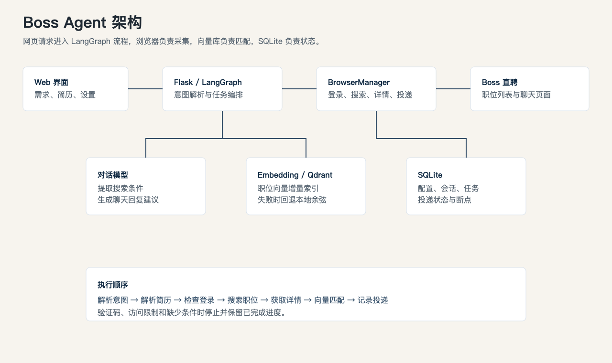
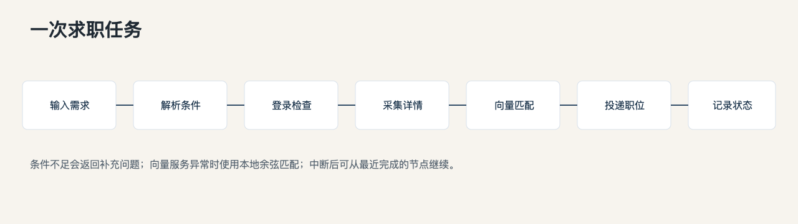

# Boss Agent

Boss Agent 是一个本地运行的求职流程助手。它把自然语言需求解析为 Boss 直聘的搜索条件，采集职位详情，用向量相似度筛选职位，并记录投递进度。



## 能做什么

- 从自然语言中提取职位、城市、薪资、经验、学历和排除条件。
- 通过本机浏览器检查登录、搜索职位、读取详情并执行投递。
- 用 Qdrant 保存职位向量；服务不可用时回退到本地余弦匹配。
- 在 SQLite 中保存配置、会话、任务进度和投递状态，支持中断后继续。
- 可选监听 Boss 聊天页面，并生成待确认的回复建议。



## 运行

要求 Python 3.10 及以上。

```bash
python3 -m venv .venv
source .venv/bin/activate
pip install -r request.txt
pip install pymupdf python-docx
python main.py
```

浏览器打开 [http://127.0.0.1:5000](http://127.0.0.1:5000)。

首次使用时，在页面设置中分别填写对话模型和 Embedding 模型的 API Key、Base URL、模型名称。Embedding 模型需要返回向量，例如 `text-embedding-3-small`。

首次搜索时，程序会打开 Boss 直聘页面。若尚未登录或出现验证码，需要在该浏览器窗口中手动完成，然后继续任务。

## 配置

页面设置会写入 `data/config.db`。也可以用环境变量提供初始值：

```bash
export chat_openai_api_key="your-chat-key"
export chat_openai_base_url="https://api.openai.com/v1"
export chat_openai_model="gpt-4o-mini"
export embedding_openai_api_key="your-embedding-key"
export embedding_openai_base_url="https://api.openai.com/v1"
export embedding_openai_model="text-embedding-3-small"
```

Qdrant 默认启用，数据保存在 `data/qdrant/`。填写 `qdrant_url` 后改为连接远程 Qdrant；受保护实例再填写 `qdrant_api_key`。设置 `qdrant_enabled=false` 可关闭向量库。

`auto_reply=true` 会启动聊天监听。自动回复只根据已有对话生成简短建议，不会编造学历、经历或薪资承诺。

## 项目结构

- `main.py`：启动 Web 服务和可选聊天监听。
- `web_flask.py`：页面、配置、会话和任务接口。
- `body.py`：意图解析、简历解析和 LangGraph 流程。
- `browser.py`：Boss 页面操作。
- `job.py`：详情采集、匹配和投递管线。
- `vector_store.py`：Qdrant 索引与召回。
- `conversation_store.py`、`delivery_store.py`：SQLite 状态存储。

## 测试

```bash
python3 -m unittest discover -s test -p 'test_*.py' -q
```

`test/test_job_detail_click.py` 和 `test/smoke_browser_job_details.py` 会打开真实浏览器，只在需要验证 Boss 页面结构时手动运行。

## 数据与限制

`.env`、SQLite 数据库、简历、浏览器用户目录、Qdrant 数据和运行日志都保留在本机，不应提交到 Git。

程序依赖 Boss 页面结构和本机登录状态。页面改版、验证码、访问限制或账号风控都可能使采集中断；任务会保留已完成的进度，但不会绕过网站限制。
